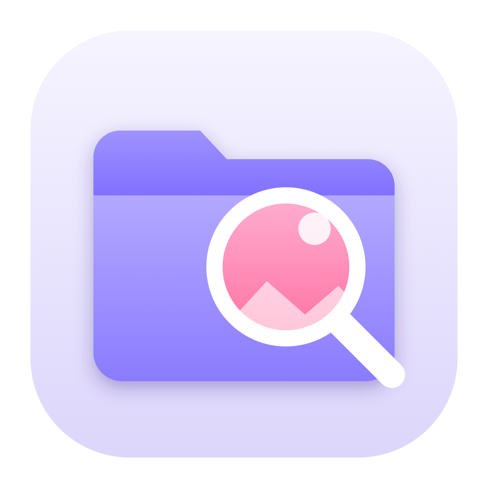

<p align="center"></p>

<h1 align="center">DevXplorer</h1>

<p align="center">A file manager for Windows with the look and feel of the Mac's Finder and Quick Look.</p>

## Features

- **See before you open**: every folder shows a collage of what it contains, and every file a real preview: photos, videos (playing on hover), PDFs, 3D models (STL, OBJ, PLY, 3MF), documents and code.
- **Quick Look**: press Space on any file to preview it full screen, with zoom, an info panel and media controls. PDFs open in a built-in viewer with selectable text.
- **Icons or list**: a card grid with previews, or a sortable list with name, date, size and kind. Group by day, month, kind or extension.
- **Fast navigation**: tabs, back and forward, an editable path bar, a "Go to" palette (Ctrl+K), search in the current folder or in all its subfolders, type to select.
- **Everyday file work**: copy, move, rename (also many files at once), compress and extract ZIP files, all undoable with Ctrl+Z, with progress and a stop button for long operations.
- **Made for Windows**: program and shortcut icons, OneDrive online-only files, drive usage, "Open in DevXplorer" in the File Explorer menu, Open with, Run as administrator, Open in Terminal.
- **Extensions**: optional tools for specific work, such as publishing statuses for social media content and free tags, with filters in the top bar.
- **Light and dark themes**, accent colors and the Windows 11 glass effect. English and Italian.

## Install

The easiest way is the Microsoft Store, which installs and updates DevXplorer for you:

<a href="https://apps.microsoft.com/detail/9PLQ6K8L0FT2"></a>

You can also download the installer from the [latest release](https://github.com/0xDevDav/devxplorer/releases/latest). This version updates itself from the GitHub releases and adds "Open in DevXplorer" to the File Explorer menu. Windows may show a SmartScreen warning because the installer is not code-signed: choose "More info" and then "Run anyway".

## Build from source

Requires Node.js 22 or later.

```sh
npm install
npm start          # run the app
npm test           # run the tests
npm run dist       # build the installer in dist/
```

## License

[MIT](LICENSE) © 0xDevDav
